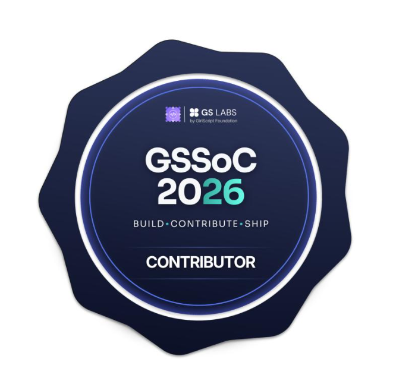

# Hi, I'm Ishani 👋

### Aspiring Full Stack Developer &nbsp;·&nbsp; Open Source Contributor &nbsp;·&nbsp; CSE Student

  
  

---

## 💫 About Me

- 🔭 Currently contributing to open-source projects and building personal web apps
- 👯 Looking to collaborate on **Web Development** and **Open Source** projects
- 🌱 Exploring **System Design**, **Backend Development**, **DSA**, and **DevOps**
- 💬 Ask me about **C++**, **DSA**, **Git/GitHub**, or **Web Development**
- ⚡ Fun fact: I debug better at 2 AM than during the day 😭

---

## 🌐 Connect With Me

  
  

---

## 🧰 Tech Stack

**Languages**

**Frameworks & Libraries**

**Tools & Platforms**

**Databases**

**Design**

---

## 📊 GitHub Stats

  

---

## 🧠 LeetCode Stats

  

---

## 🏅 Certifications

  <table>
    <tr>
      <td align="center" width="250">
        
          
        <b>AWS Academy</b> 
        Data Engineering · Trained
      </td>
      <td align="center" width="250">
        
          
        <b>GSSoC 2026</b> 
        Contributor / Mentee
      </td>
    </tr>
  </table>

---

## 🕹️ Contribution Graph

  <picture>
    <source media="(prefers-color-scheme: dark)" srcset="https://raw.githubusercontent.com/SecuredByIshani/SecuredByIshani/output/pacman-contribution-graph-dark.svg" />
    <source media="(prefers-color-scheme: light)" srcset="https://raw.githubusercontent.com/SecuredByIshani/SecuredByIshani/output/pacman-contribution-graph.svg" />
    
  </picture>

---

  
    
  <i>🌌 Destiny always demands patience 🌌</i>

